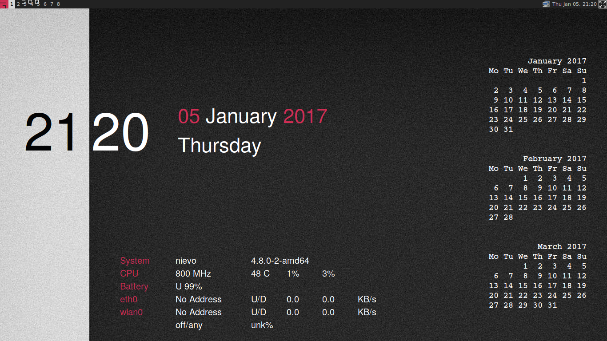

# awesome-config

My configuration file and theme for the [awesome desktop manager](https://awesomewm.org/)

* Version: 1.1.8
* Date: 2017-01-06
* Developer: [Alberto Pettarin](http://www.albertopettarin.it/)
* License: the MIT License (MIT)
* Contact: [click here](http://www.albertopettarin.it/contact.html)


## Screenshot




## Installation

1. Clone this repository and put/symlink its contents into ``~/.config/awesome``:

    ```bash
    $ cd /path/to/a/storage/directory/of/your/choice
    $ git clone https://github.com/pettarin/awesome-config --recursive
    $ mv ~/.config/awesome ~/.config/awesome.backup
    $ ln -s awesome-config ~/.config/awesome
    ```

2. Navigate to ``~/.config/awesome/themes/niceandclean/resolutions``
   and symlink the correct resolution to ``default``:

    ```bash
    $ cd ~/.config/awesome/themes/niceandclean/resolutions
    $ rm default
    $ ln -s 1366x768 default
    ```

3. Hit ``Mod4 + Shift + r`` to reload.


## Configuration

### Layouts

* floating
* tile left
* tile float
* spiral
* max
* magnifier

Hit ``Mod4 + space`` to change the layout of the current screen.

### Screens

Eight screens, labelled from ``1`` to ``8``.
(I do not use tags for screens.)

### Menus

Hit ``Mod4 + z`` to show a quick menu launching
terminals, email client, browsers, skype, and quit.

Probably you might want to personalize it
with the programs you use most frequently.

### Key Bindings

* ``Mod4 + left`` or ``Ctrl + Alt + left``: previous screen
* ``Mod4 + right`` or ``Ctrl + Alt + right``: next screen
* ``Mod4 + 1``: go to screen 1
* ``Mod4 + Shift + 1``: move current window to screen 1
* ``Mod4 + e``: revelation (expose-like window selector)
* ``Mod4 + up`` or ``Mod4 + Shift + down``: move current window up in tiled mode
* ``Mod4 + down`` or ``Mod4 + Shift + up``: move current window down in tiled mode
* ``Ctrl + Esc`` to ``Ctrl + Insert``: Fn-like bindings, via a ThinkPad-specific Bash script (toggle/increase/decrease audio, toggle touchpad, take a screenshot, etc.)
* ``Mod4 + Tab``: cycle through windows in the current screen
* ``Mod4 + Return``: open a new terminal window
* ``Mod4 + r`` or ``Mod4 + x``: open quick execute prompt in menu top bar
* ``Mod4 + Ctrl + r`` or ``Mod4 + Shift + r``: reload configuration
* ``Mod4 + Shift + q``: quit session
* ``Mod4 + Space``: change current window to next layout
* ``Mod4 + Shift + Space``: change current window to previous layout
* ``Mod4 + f`` or ``F11``: toggle current window fullscreen
* ``Mod4 + w`` or ``Mod4 + Shift + c``: kill current window
* ``Mod4 + Ctrl + space``: toggle current window floating
* ``Mod4 + a`` or ``Mod4 + t``: toggle current window ontop
* ``Mod4 + n``: minimize current window
* ``Mod4 + m``: maximize current window
* ``Mod4 + l``: increase current window height/width in tiled mode
* ``Mod4 + h``: decrease current window height/width in tiled mode
* ``Mod4 + Shift + l``: move current window in tiled mode
* ``Mod4 + Shift + h``: move current window in tiled mode


## Acknowledgements

The theme is a customized version of ``niceandclean`` by ``Blazeix``,
based off of ``ghost1227``'s openbox theme
([original code](https://github.com/waf/nice-and-clean-theme)).

The ``revelation`` plugin has been created by ``guotsuan``
([original code](https://github.com/guotsuan/awesome-revelation)).


## License

**awesome-config** is released under the MIT License.


